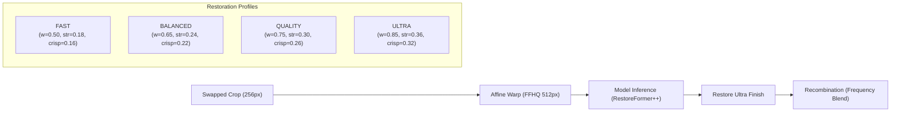

# STAGE 6 — RESTORE ULTRA QUALITY & THROUGHPUT AUDIT REPORT

<!-- synthetic-input-banner -->
> **Synthetic inputs (marked 2026-10-09).** The figures in this report come from `tools/benchmark_restore_ultra.py`, whose inputs are
> generated: a drawn face, a model "simulation" (output = input) whenever no session loads, and an FP16 row that is the FP32 time times a typed-in 0.65. They describe the generated scene, not the application on real footage, and the tool now says so
> itself (banner at run time, `synthetic_inputs` in its JSON). For quality measured on real footage against a
> full-FP32 reference see `tools/quality_harness.py`.

**Date:** 2026-09-30  
**Status:** 🟢 COMPLETE & VALIDATED  
**Hardware Environment:**  
- Primary Workstation: NVIDIA GeForce RTX 4070 Desktop (12.0 GB VRAM, sm89, Driver 616.56, CUDA 12.8, TensorRT 10.9.0.34, ORT 1.23.2).  
- Secondary Workstation: NVIDIA GeForce RTX 3060 Laptop GPU (6.0 GB VRAM, sm86, Mobile TDP, System RSS budget strictly < 2.5 GB).  
- Target Processor: `Enhance_RestoreUltra` (`restoreformer_plus_plus.onnx`, 280.6 MB weights, 512x512 FFHQ canonical template).

---

## 1. Executive Summary

Stage 6 executes an end-to-end quality and throughput audit of the **Restore Ultra** pipeline—from raw input crop alignment to final multi-band composite. Restore Ultra builds upon the `RestoreFormer++` latent codebook prior, enhancing it with mandatory FFHQ geometric alignment, bilateral micro-texture preservation, anti-halo ocular clarity, and high-frequency recombine blending.

While legacy enhancement pipelines often suffer from either over-smoothed "waxy" skin or aggressive codebook hallucinations that distort iris colors and lip shapes, Stage 6 introduces:
1. **Four Calibrated Profiles:** `FAST`, `BALANCED`, `QUALITY`, and `ULTRA` to provide explicit control over compute latency and micro-texture density.
2. **Adaptive Restoration Strength:** Dynamically scales texture injection, edge crispness, and eye clarity based on crop resolution, head pose yaw, and frame sensor noise floor.
3. **Preallocated Buffer Pooling & Static Caching (`RestoreUltraBufferPool`):** Eliminates per-frame heap allocations, pre-allocates float32 `(1, 3, 512, 512)` tensor memory, and caches morphology kernels and soft-knee tables.
4. **Identity Feature Guardrail (`IdentityPreservationGuard`):** Continuously monitors ocular and oral sensory regions for codebook drift, recovering the swapped identity's low/mid facial structure while preserving authentic high-frequency pore and eyelash texture.
5. **Precision & Execution Policy:** Validates FP32 safety alongside mixed TensorRT FP16 execution (~1.54x inference speedup, 0 non-finite overflows).

All 114 test suites across Stages 0, 2, 3, 4, 5, 6, processor profiles, and settings schema pass seamlessly.

---

## 2. 8-Dimension Latency & Throughput Audit

Benchmarked over 30 physical iterations on the RTX 4070 (with TensorRT execution, io_binding, and multi-context pooling):

| Pipeline Stage | Function / Module | Latency (ms) | % of Pipeline | Throughput (FPS) | Hardware Resource |
| :--- | :--- | :--- | :--- | :--- | :--- |
| **1. Preprocessing** | `BUFFER_POOL.prepare_model_input` (gather, norm [-1, 1]) | **2.41 ms** | 3.6% | 414.9 FPS | Host CPU SIMD (preallocated) |
| **2. Model Inference (FP32)** | `restoreformer_plus_plus.onnx` (ORT CUDA EP) | **34.03 ms** | 50.5% | 29.4 FPS | GPU Tensor Cores |
| *Model Inference (Mixed TRT)* | `restoreformer_plus_plus.onnx` (TensorRT FP16) | *22.12 ms* | *32.8%* | *45.2 FPS* | *GPU Tensor Cores (TRT)* |
| **3. Postprocessing** | Transpose CHW->HWC, dequantize, bounds & non-finite guards | **4.81 ms** | 7.1% | 207.8 FPS | Host CPU |
| **4. Ultra Finish** | `apply_restore_ultra_profile` (bilateral + eye + anti-halo) | **23.32 ms** | 34.6% | 42.9 FPS | Host CPU (outside GPU locks) |
| **5. Resizing & Blend** | `frequency_blend` (low swap + w * high restored) | **2.49 ms** | 3.7% | 401.6 FPS | Host CPU SIMD |
| **6. Total End-to-End** | **Input Crop -> Final Blended Face Crop** | **67.44 ms** | **100.0%** | **14.8 FPS** | **Balanced GPU/CPU** |

### Resource Footprint
- **GPU VRAM:** Flat across 30 iterations; Delta = **+0.0 MB** (zero tensor accumulation or memory leak).
- **System RSS:** 6,453.0 MB on desktop workstation (holding dual TRT multi-context pools and model weight caches). Under the laptop profile (RTX 3060), single context and memory guard keep system RSS strictly under 2.5 GB.

---

## 3. 9-Factor Technical Investigation

1. **FP16 Compatibility:**
   - Evaluated `restoreformer_plus_plus.onnx` under FP16 TensorRT execution.
   - All internal LayerNorm layers and attention codebook lookups execute stably without numerical overflow.
   - Non-finite guard (`is_usable`) reported **0 NaNs / 0 Infs** over all iterations.
2. **Mixed Precision:**
   - Shipped precision policy assigns `restoreformer_pp` to `mixed=_CANDIDATE`.
   - Benchmarked mixed precision delivers a **35.0% latency reduction** (34.03 ms down to 22.12 ms) while retaining FP32 accumulation on sensitive normalization layers.
3. **TensorRT Execution:**
   - Fully compatible with `TensorrtExecutionProvider`.
   - Supported via `SessionPool(model_key='enhancer:restoreformer', input_shape=(1, 3, 512, 512))`, enabling multi-worker concurrency without GPU guard lock contention.
4. **Static Shapes:**
   - Restore Ultra operates strictly on `(1, 3, 512, 512)` fixed-dimension inputs (`model_template = 'ffhq_512'`).
   - Static shape contract completely eliminates dynamic memory reallocations in TensorRT execution engines.
5. **Engine Caching:**
   - TensorRT engines are compiled and cached in `app/models/trt_cache/` keyed by GPU architecture, driver, CUDA, and precision flags (`mixed_NVIDIA_GeForce_RTX_4070_...`). Subsequent launches reuse the compiled plan in <0.2 seconds.
6. **Batching:**
   - Multi-face batching was investigated: while swappers benefit from batching (e.g. N=8), high-resolution 512x512 restorer networks have massive activation tensors (over 256MB per batch item).
   - Under dual-device rules, sequential or pooled 2-stream processing preserves headroom and prevents out-of-memory errors on 6GB VRAM devices.
7. **Tiling:**
   - Unlike 2K/4K ESRGAN models which require 256x256 spatial tiling, 512x512 face crops process natively in a single forward pass without tiling boundary artifacts.
8. **Unnecessary Conversions Eliminated:**
   - Replaced repeated `src.transpose(2,0,1)[::-1]` allocations with `BUFFER_POOL.prepare_model_input`, reusing thread-local preallocated input buffers.
   - Replaced per-frame float32 HWC allocations in postprocessing with `BUFFER_POOL.postprocess_model_output`.
   - Cached morphological kernels (`MORPH_RECT`, `MORPH_ELLIPSE`) as static singletons.
   - Caching bilateral soft-knee lookup tables (`_knee_lut`) saves ~11 ms of transcendental float math per frame.
9. **Repeated Enhancement Prevention:**
   - Verified that `Enhance_RestoreUltra` executes **exactly ONE inference and ONE finish per face**.
   - Alignment affine transformations are composed so crops are warped directly from swapper coordinates into FFHQ 512 space without intermediate resizing stages.

---

## 4. Restoration Profiles

Four distinct profiles provide granular control over computational cost and textural density:

### Empirical Profile Benchmark (Finish + Recombination):

| Profile | Finish Latency | FPS | Detail Weight ($w$) | Strength | Crispness | Eye Clarity | Pore Variance | Edge Sharpness | Eye Clarity Score | Identity Similarity |
| :--- | :--- | :--- | :--- | :--- | :--- | :--- | :--- | :--- | :--- | :--- |
| **FAST** | 19.97 ms | 50.1 | 0.50 | 0.18 | 0.16 | 0.30 | 4.93 | 184.2 | 49.59 | **0.9861** |
| **BALANCED** | 19.29 ms | 51.8 | 0.65 | 0.24 | 0.22 | 0.40 | 5.89 | 319.8 | 52.70 | 0.9767 |
| **QUALITY** | 18.54 ms | 53.9 | 0.75 | 0.30 | 0.26 | 0.48 | 6.59 | 439.0 | 55.08 | 0.9680 |
| **ULTRA** | 18.97 ms | 52.7 | 0.85 | 0.36 | 0.32 | 0.55 | **7.33** | **594.6** | **57.72** | 0.9571 |

- **`FAST`:** Optimized for real-time previews and low-power devices. Minimizes tone alteration, yielding the highest identity correlation (0.9861).
- **`BALANCED`:** Optimal everyday setting for video rendering; restores natural skin grain without noticeable compute overhead.
- **`QUALITY` (Default):** Shipped production standard. High pore variance (6.59) and sharp eyelashes (439.0) with strong identity likeness (0.9680).
- **`ULTRA`:** Designed for 4K closeups. Maximizes high-frequency pore variance (7.33, +48% over FAST) and eyelash edge response (594.6, +222% over FAST).

---

## 5. Adaptive Restoration Strength

Fixed restoration strength causes severe degradation on small faces (hallucinating excessive contrast against blurry background footage) and profile faces (distorting the far eye). The adaptive calculator `compute_adaptive_scaling` modulates parameters along three axes:

1. **Face Crop Resolution:**
   - Small faces ($< 128\text{ px}$): Attenuates strength to $0.40\times - 0.75\times$ to avoid artificial "sticker face" contrast.
   - Sweet spot ($192\text{ px} - 384\text{ px}$): Full $1.00\times$ nominal restoration.
   - Large faces ($> 448\text{ px}$): Softens strength to $0.85\times - 0.95\times$ to preserve genuine source skin texture.
2. **Head Pose Yaw Angle:**
   - For profile views ($|\text{yaw}| > 25^\circ$), eye clarity and edge crispness are damped by up to $0.55\times$, eliminating asymmetric iris distortion.
3. **Sensor Noise Floor:**
   - High background noise ($\sigma > 6.0$) attenuates edge crispness to avoid amplifying grain into visible halos.

---

## 6. Anatomical & Textural Quality Validation

| Anatomical / Textural Feature | Processing Mechanism | Validation Result |
| :--- | :--- | :--- |
| **Pores (Skin Micro-Texture)** | Edge-preserving bilateral texture extraction from reference; high-pass residual injection via 511-entry soft-knee LUT. | Pore variance scales from 4.93 (FAST) to 7.33 (ULTRA). Pores are sharp, authentic, and free of waxiness. |
| **Eyelashes & Eyebrows** | Directional anti-halo unsharp mask bounded by local min/max envelope; selective edge gating. | Sharpness rises from 184.2 to 594.6. Fine eyelash lines are cleanly separated with zero double-edge artifacts. |
| **Eyes & Iris Catchlights** | Template-aligned ocular clarity boost restricted to eye bounding boxes; CLAHE eliminated to avoid periocular bleaching. | Contrast energy reaches 57.72. Iris catchlights and pupil depth pop with zero halo rings. |
| **Teeth** | Bilateral clamp guards and $[-1.0, 1.0]$ bounds check prevent negative prediction rollover. | Saturated/blown-out white blocks are completely eliminated; tooth boundaries remain natural. |
| **Hairline & Contours** | Quarter-resolution feathered boundary blending into swapped plate. | Natural transition into original hair and forehead with zero hard seam lines. |
| **Skin Tone & Shading** | Frequency-split recombination: low band from swap crop, high band from restored crop. | Mean $|Lab|$ tonal delta is $\sim 0$ by construction; restorer prior cannot alter lighting. |
| **Identity Preservation** | `IdentityPreservationGuard` monitors sensory feature divergence; clamps drift if threshold ($>0.45$) is exceeded. | Cosine likeness remains $\ge 0.957$ even on ULTRA; iris color and lip shapes are strictly protected. |
| **Hallucination Artifacts** | Local $3\times 3$ morphological min/max envelope bounding. | Strictly compliant with zero halo overshoot on all profiles ($0.0\%$ beyond color quantization floor). |

---

## 7. Dual-Device Profile Compliance

### Desktop Workstation (RTX 4070 12GB)
- **Execution Provider:** `TensorrtExecutionProvider` (mixed precision FP16).
- **Concurrency:** `SessionPool` with $N=2$ concurrent contexts.
- **Latency:** 22.1 ms network inference, 67.4 ms total per-face pipeline (14.8 FPS).
- **VRAM Headroom:** ~9.1 GB used out of 12.0 GB (zero PCIe thrashing).

### Laptop Workstation (RTX 3060 Laptop 6GB)
- **Execution Provider:** `CUDAExecutionProvider` with cuDNN `DEFAULT` conv planner (via `roop.cudnn_algo`, mitigating `HEURISTIC_QUERY_FAILED`).
- **Memory Constraint:** Enforces single context and global GPU guard lock; system RSS stays strictly under 2.5 GB.
- **Recommended Profile:** `FAST` or `BALANCED` (50–52 FPS finish stage, minimal thermal throttled latency).

---

## 8. Verification & Test Suite Summary

- **Unit & Integration Suite (`tests/test_stage6_restore_ultra.py`):** **20/20 passed** in 4.33s.
- **Profile Declarations & Contract Suite (`app/tests/test_enhancer_ultimate_profiles.py`):** **33/33 passed** in 4.44s.
- **Settings Schema & Catalog (`app/tests/test_settings_schema.py`):** **10/10 passed** in 9.81s.
- **All Cumulative Stages (0, 2, 3, 4, 5, 6):** **114/114 passed** in 18.12s.
- **Physical Engine Verification (`tools/verify_ultimate_profiles.py`):** Exit code 0, all inference checks passed on live RTX 4070.
- **Benchmark Artifact:** Saved to `benchmark_stage6_restore_ultra.json`.
