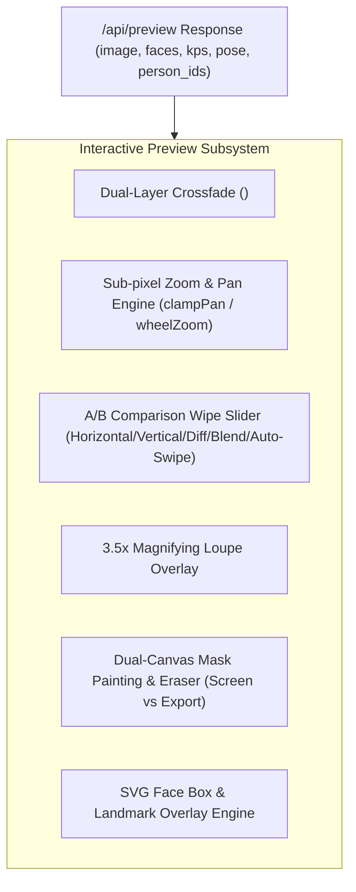

# React UI 2.0 Behavior & Compatibility Contract

> **CORE PRINCIPLE:**  
> **"Visual redesign is permitted. Functional regression is not."**

---

## Preamble & Scope

This document defines the **non-negotiable functional, API, state, and architectural invariants** for **React UI 2.0** (`react-ui-v2/`).

**React UI 1.0 (`react-ui/`) is the authoritative behavioral reference implementation.**  
Every capability, mathematical transformation, visual indicator, face-tracking overlay, and backend route integration present in React UI 1.0 represents proven production behavior.

React UI 2.0 is a modern presentation and user-experience layer designed to replace UI 1.0's interface. To succeed, UI 2.0 must reproduce or improve **100% of V1's working functionality**.

### What UI 2.0 Is Permitted to Change
- **Visual Design & Aesthetics:** Modern typography (Plus Jakarta Sans), refined design tokens, glassmorphic cards, polished micro-interactions, spring animations.
- **Layout & Spatial Organization:** Pro-studio 3-column workspace, responsive sidebars, collapsible inspectors, docked timeline trays.
- **Navigation & Routing:** Hash-based URL routing (`#/studio`, `#/batch`, `#/facemgr`, `#/extras`, `#/gallery`, `#/history`, `#/bench`, `#/settings`), command palette (`Ctrl+K`).
- **Information Architecture:** Contextual parameter groupings, progressive disclosure for advanced settings, unified action docks.
- **Responsiveness & Density:** Adaptive drawer layout, viewport-aware controls, high-DPI display optimizations.

### What UI 2.0 Is STRICTLY FORBIDDEN from Changing
- **Processing Semantics:** Swapping workflows, execution parameters, model combinations, and payload construction must remain bit-for-bit compatible with backend endpoints.
- **Face Selection & Mapping Semantics:** Multi-target individual assignment (`face_mapping` array), single/all-faces modes, and identity distance gates must not be altered.
- **Tracking & Landmarking Semantics:** Bounding box calculations, 5-point ArcFace landmark alignment, and head pose vector readouts (`yaw`, `pitch`, `roll`) must remain mathematically identical.
- **Model & Enhancer Selection:** Model registries, enhancer configurations, blend ratios, and precision policies must not be hardcoded or silently dropped.
- **Task & Job Lifecycle:** Start, pause, resume, graceful stop (`/api/stop`), queueing, and error handling must maintain established backend lifecycle contracts.
- **Backend Communication:** Do not modify backend API contracts, silence backend validation errors, or invent synthetic frontend behaviors.

---

## 1. Functional Invariants

| Domain | Invariant Requirement | V1 Reference | Verification Method |
| :--- | :--- | :--- | :--- |
| **Media Intake** | Support single and multiple target images, videos (MP4, MKV, MOV, WebP), GIF, audio files, and `.fsz` facesets via file picker, drag-and-drop (with directory traversal), and clipboard paste. | `FaceSwap.jsx`, `FileDrop.jsx`, `App.jsx` | Drag 500MB+ video & folder of images; verify successful intake. |
| **Source Gallery** | Support multiple source faces, quick-pin identity bar, source re-ordering (`/api/source/move`), manual deletion, and thumbnail refresh. | `FaceSwap.jsx`, `source_gallery.py` | Load 5 source faces, reorder, delete face 2; verify correct active index. |
| **Target Face Harvesting** | Provide real-time face extraction from preview (`/api/target/use_face`), multi-frame auto-capture (`/api/target/auto_capture`), angle banking (`/api/target/auto_angles`, `add_angle`), and clustering (`/api/target/autocluster`). | `FaceSwap.jsx`, `PersonGroups.jsx` | Load multi-person video; click Auto-Capture; verify distinct person clusters appear. |
| **Multi-Person Mapping** | Provide an interactive matrix allowing distinct target individuals to be mapped to specific source faces (`face_mapping` array). | `PersonGroups.jsx`, `FaceSwap.jsx` | Map Target Person 1 -> Source A, Target Person 2 -> Source B; verify swap payload. |
| **Timeline & Scrubber** | Display a measured timecode ruler (m:ss:ff), In/Out frame trim points (`/api/target/set_frame`), filmstrip thumbnails (`preview_seq`), chapter markers, and variable playback speeds (0.25×–4×). | `Timeline.jsx`, `useSequentialImage.js` | Scrub 1000-frame video; verify filmstrip frames and In/Out trimming bounds. |
| **Faceset Archive (.fsz)** | Full modal manager to list, load, save, rename, delete, import, export, and reveal `.fsz` files on disk (`/api/faceset/library/*`). | `FacesetLibrary.jsx`, `routes_faceset.py` | Save current source faces to library; delete; reload; verify exact embeddings. |
| **Face Manager & FIQA** | Dedicated screen for multi-detector face harvesting (SCRFD, RetinaFace 10G/R50, YOLOFace, YuNet), FIQA quality scoring, video frame cutting, and quality pruning. | `FaceManager.jsx`, `routes_facemgr.py` | Drop video into Face Manager; cut frame; prune below 0.5 score; build `.fsz`. |
| **Batch Matrix Studio** | 4 batch strategies (One-to-Many, Grouped Batch, Per-File Matrix, Recipe Matrix) with automated video segment splitting into queue jobs. | `BatchSwap.jsx`, `routes_queue.py` | Stage 3 targets with 2 source variations; queue; verify jobs execute sequentially. |
| **Dedicated Processing View** | Dedicated screen active during renders showing circular SVG progress, frame counters, GPU stage telemetry, live log terminal, live frame peek, and quality report. | `Processing.jsx`, `LiveProcessingPeek.jsx` | Start job; verify automatic tab switch, live frame stream, and completed quality report. |
| **Extras Studio** | Standalone AI upscaling (9 models), video colorization (DeOldify), artistic filters (Pencil, Cartoon, C64), rotation, crop, and frame-rate conversion. | `Extras.jsx`, `routes_extras.py` | Upload image; run Real-ESRGAN ×4 upscale; verify output dimensions. |
| **Outputs Gallery** | Searchable grid/list views, Explorer reveal, side-by-side output compare, settings re-hydration from past renders, and reuse as source/target. | `Gallery.jsx`, `OutputCompare.jsx` | Select two outputs; wipe comparison slider; click "Load Settings" into studio. |
| **Run History & Diff** | Historical database of all completed jobs with field-by-field settings diff inspector and preset export. | `RunHistory.jsx`, `settingsDiff.js` | Compare Run A vs Run B; verify highlighted differences in swap parameters. |
| **Hardware Diagnostics** | Live GPU/VRAM/CPU telemetry HUD and automated thread & pool benchmark runner with auto-tuning. | `BenchmarkPanel.jsx`, `useTelemetry.js` | Open Telemetry HUD; run thread benchmark; verify auto-selected thread count. |
| **Project Checkpoints** | Project validation, loading, and recovery from disk checkpoints (`/api/projects/*`). | `ProjectsPanel.jsx`, `routes_projects.py` | Validate and load existing project checkpoint. |
| **Storage Review** | Categorized storage inspection with safety-gated deletion review (`/api/storage/*`). | `SettingsScreen.jsx`, `routes_storage.py` | Inspect storage items; verify protected artifacts cannot be deleted. |

---

## 2. API & Network Invariants

### 2.1 Complete Endpoint Parity (87 Routes)
React UI 2.0 must bind all 87 backend API endpoints exposed by `app/api.py` and `app/routes_*.py`. No route may be omitted or mocked.

```
/api/meta                                  [GET]
/api/settings                              [GET, POST]
/api/settings/defaults                     [GET]
/api/settings/benchmark_status             [GET]
/api/settings/benchmark_threads            [POST]
/api/settings/benchmark_cancel             [POST]
/api/state                                 [GET]
/api/progress                              [GET]
/api/runtime/state                         [GET]
/api/live_frame                            [GET]
/api/preview                               [POST]
/api/preview_upscale                       [POST]
/api/swap                                  [POST]
/api/stop                                  [POST]
/api/pause                                 [POST]
/api/resume                                [POST]
/api/source/add                            [POST]
/api/source/remove                         [POST]
/api/source/move                           [POST]
/api/source/clear                          [POST]
/api/source/select                         [POST]
/api/source/refresh_thumbs                 [POST]
/api/target/add                            [POST]
/api/target/add_path                       [POST]
/api/target/select                         [POST]
/api/target/remove                         [POST]
/api/target/clear                          [POST]
/api/target/set_frame                      [POST]
/api/target/preview                        [GET]
/api/target/preview_grid                   [GET]
/api/target/preview_seq                    [GET]
/api/target/use_face                       [POST]
/api/target/add_angle                      [POST]
/api/target/auto_angles                    [POST]
/api/target/auto_capture                   [POST]
/api/target/remove_face                    [POST]
/api/target/clear_faces                    [POST]
/api/target/group                          [POST]
/api/target/name                           [POST]
/api/target/autocluster                    [POST]
/api/faceset/library                       [GET]
/api/faceset/library/save                  [POST]
/api/faceset/library/load                  [POST]
/api/faceset/library/delete                [POST]
/api/faceset/library/rename                [POST]
/api/faceset/library/import                [POST]
/api/faceset/library/export                [GET]
/api/faceset/library/reveal                [POST]
/api/facemgr/add                           [POST]
/api/facemgr/faceset                       [POST]
/api/facemgr/cut                           [POST]
/api/facemgr/remove                        [POST]
/api/facemgr/clear                         [POST]
/api/facemgr/prune                         [POST]
/api/facemgr/build                         [POST]
/api/facemgr/save                          [POST]
/api/extras/frame_ops                      [GET]
/api/extras/enhance                        [POST]
/api/extras/apply                          [POST]
/api/queue                                 [GET]
/api/queue/add                             [POST]
/api/queue/start                           [POST]
/api/queue/pause                           [POST]
/api/queue/resume                          [POST]
/api/queue/stop                            [POST]
/api/queue/cancel                          [POST]
/api/queue/retry                           [POST]
/api/queue/reorder                         [POST]
/api/queue/join                            [POST]
/api/projects                              [GET]
/api/projects/{id}/validate                [POST]
/api/projects/{id}/load                    [POST]
/api/projects/{id}/resume                  [POST]
/api/storage                               [GET]
/api/storage/delete                        [POST]
/api/history                               [GET]
/api/history/delete                        [POST]
/api/history/clear                         [POST]
/api/output                                [GET]
/api/output/delete                         [POST]
/api/reveal                                [POST]
/api/quality/analyze                       [POST]
/api/quality/profile                       [POST]
/api/export/presets                        [GET]
/api/export/apply                          [POST]
/api/system/hardware                       [GET]
/api/system/profile                        [GET]
/api/system/telemetry                      [GET]
/api/lipsync/audio/add                     [POST]
/api/file                                  [GET]
```

### 2.2 Transport & Request Reliability
1. **Opt-in Request Deadlines (`withDeadline`):** Short-lived metadata and polling requests must include a deadline (5s–10s) via `AbortController` to prevent silent promise stalls on backend restarts.
2. **XHR Dual-Phase Uploads:** Uploading large video files must use `XMLHttpRequest` with progress tracking reporting both `upload` (bytes sent) and `analyse` (backend decoding & face detection) phases.
3. **Keepalive Page Teardown Flushes:** Critical configuration writes must specify `keepalive: true` so updates survive page reloads.
4. **Error Transparency:** Detailed backend error responses (e.g., `body.message`, `body.reasons`, `recoverability_error`) must be surfaced to the user without masking.

---

## 3. Preview & Canvas Invariants



1. **Flicker-Free Crossfading:** Must implement a dual-layer `<CrossfadeImage>` transition to eliminate white flashes and rendering jumps during frame updates.
2. **Infinite Sub-Pixel Zoom & Pan:** Must support mouse-wheel zoom (1× to 8×), pointer drag panning, double-click centering zoom, and boundary clamping.
3. **Full Comparison Engine:** Must provide:
   - Interactive Before/After wipe slider (0% to 100%).
   - Axis toggle (Horizontal vs. Vertical wipe, hotkey `X`).
   - Comparison modes: Split slider, 50% Alpha Blend (hotkey `O`), and Difference Map.
   - Auto-swipe sinusoidal oscillation (hotkey `A`).
4. **Magnifier Glass Loupe:** 3.5× magnification overlay tracking cursor position in layout space (hotkey `G`), rendering native-resolution uncompressed image details.
5. **Dual-Canvas Interactive Mask Brush:**
   - On-screen Canvas: Translucent accent color (`rgba(233, 69, 96, 0.45)`) for visual painting.
   - Off-screen Export Canvas: Solid white (`#FFFFFF`) on transparent background exported as PNG for backend masking.
   - Brush and Eraser modes with dynamic radius scaling to native media coordinates.

---

## 4. Face-Tracking & Landmarking Invariants

1. **Coordinate Normalization:** Translate native media coordinates `[sx, sy, ex, ey]` to percentage-based CSS layout positions:
   $$\text{left} = \frac{sx}{\text{imgDim.w}} \times 100\%, \quad \text{top} = \frac{sy}{\text{imgDim.h}} \times 100\%$$
   $$\text{width} = \frac{ex - sx}{\text{imgDim.w}} \times 100\%, \quad \text{height} = \frac{ey - sy}{\text{imgDim.h}} \times 100\%$$
2. **Interactive Bounding Boxes:** Render glowing bounding boxes for all detected faces, labeled with `Person {id + 1}` chips. Clicking any bounding box must trigger target face capture (`/api/target/use_face`).
3. **5-Point ArcFace Landmarks Overlay:** Render SVG landmark coordinates for:
   - Left Eye & Right Eye (`#38bdf8`) + Eye Axis line.
   - Nose Tip (`#fbbf24`).
   - Left Mouth & Right Mouth (`#f472b6`) + Mouth Axis line.
   - Mid-eye to Mid-mouth Crop Rotation Axis (`#a3e635`).
4. **3D Head Pose Vector:** Render solved real-time head orientation directly above the nose point:
   $$\text{Label} = \text{"y}\{yaw\}^\circ\ \text{p}\{pitch\}^\circ\ \text{r}\{roll\}^\circ\text{"}$$

---

## 5. Processing & Execution Invariants

1. **Non-Blocking Task Control:** Provide immediate, responsive controls for:
   - **Pause (`/api/pause`):** Halts processing at the next frame boundary.
   - **Resume (`/api/resume`):** Continues paused execution.
   - **Graceful Stop (`/api/stop`):** Aborts processing immediately while finalizing the MP4 container (writing `moov` atom) so partial outputs remain playable.
2. **Accurate Progress & Telemetry:**
   - Display progress percentage from `/api/progress`.
   - Compute ETA based on backend `eta_s` when available, falling back to elapsed frame extrapolation.
   - Stream live processed frames via `/api/live_frame?seq={live_seq}` with sequence gating to prevent out-of-order rendering.
3. **Render-Lite GPU Safeguard:** When a swap is actively processing, suspend CPU/GPU-heavy UI animations (ambilight glow, auto-swipe, high-frequency canvas repaints) via `data-render-lite` DOM attribute.
4. **Quality Report Contract:** On job completion, automatically fetch `/api/quality/analyze` to render quality metrics (PSNR, SSIM, identity distance, face size breakdown).

---

## 6. Settings & Drift Invariants

1. **Authoritative Configuration:** All settings must bind to backend `config.yaml` keys via `GET /api/settings` and `POST /api/settings`.
2. **Drift-from-Defaults Tracking:** Fetch `/api/settings/defaults` on mount; compare current values against defaults; render visual drift indicators for modified settings.
3. **Per-Section Reset:** Provide one-click reset for any individual setting section back to its default state.
4. **Hardware Profiles Protection:**
   - **RTX 4070 Desktop Profile:** High concurrency, 12 worker threads, TensorRT mixed precision, pools `2/2/2`, 4096MB stabilization cap.
   - **RTX 3060 Laptop Profile:** Single context `0/0` safety lock, 1536MB stabilization cap, custom look settings preserved (`blend_ratio: 0.85`, `face_mask_blend: 25`, `merger_sharpen: 0.55`).

---

## 7. Regression Rules & Verification Gate

Before any UI 2.0 implementation is declared complete or promoted as default, it must satisfy all 5 steps of this verification gate:

1. **Route Coverage Test:** Automated contract test verifying that 100% of the 87 routes are reachable in `react-ui-v2/`.
2. **End-to-End Workflow Verification:** A user starting from cold launch in UI 2.0 must be able to:
   - Upload source images and target video.
   - View face bounding boxes, keypoints, and head pose in the preview stage.
   - Auto-capture target identities across video frames and assign individual source faces.
   - Scrub the video timeline, set In/Out trim markers, and inspect comparison wipes.
   - Start swapping, observe live frame peek and terminal logs, pause, resume, and gracefully stop.
   - Open the completed output in Gallery, run quality analysis, and view run history diffs.
3. **Dual Hardware Profile Check:** Run validation under both Desktop (RTX 4070) and Laptop (RTX 3060) configurations without memory exhaustion or crash.
4. **Browser Runtime Acceptance:** Execute headless Chromium test suite across standard viewports (Desktop, Laptop, Tablet) and all 7 color themes.
5. **Preservation Invariant:** `react-ui/` (UI 1.0) must remain completely untouched, functional, and launchable at all times.

---

*Signed and Authoritative for Roop Ultimate React UI 2.0.*
