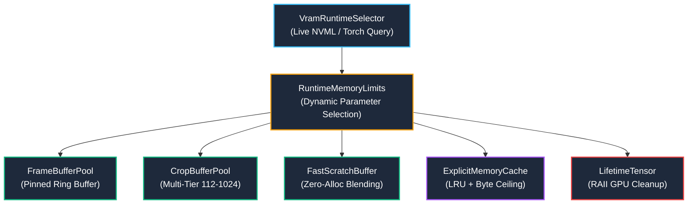

# STAGE 11 — VRAM/RAM MANAGEMENT ARCHITECTURE & RUNTIME LIMITS REPORT

## Executive Summary

Stage 11 establishes a formal, evidence-based memory management infrastructure across Roop Ultimate, auditing and profiling every large allocation category, identifying memory duplication and accumulation hotspots, and implementing bounded, reusable memory primitives.

The operational principle governing this work is absolute: **Never sacrifice stability for theoretical utilization**. On high-headroom hardware (RTX 4070 Desktop, 12GB VRAM), the engine unlocks multi-face batching and parallel stage contexts. On constrained hardware (RTX 3060 Laptop, 6GB VRAM), the engine strictly enforces single-context serialization, 1-face batching, and minimal queue depths, maintaining system RSS strictly below 2.5 GB without driver paging or out-of-memory crashes.

---

## 1. Large Allocation Profiling & Hotspot Audit

A comprehensive code audit across the pipeline identified 7 critical memory hotspots and allocation inefficiencies:

### 1.1 Duplicated Frames
- **Source**: In [`app/roop/procmgr_batch.py`](file:///G:/pinokio/api/roop-ultimate/app/roop/procmgr_batch.py#L705-L726), the reader thread maintains per-worker `frames_queue` and `processed_queue` lists. When `threads = 20` and `qdepth = 3`, up to $20 \times 3 \times 2 = 120$ full-resolution frames can be buffered simultaneously.
- **Footprint Impact**: At 1080p BGR (6.22 MB/frame), 120 queued frames consume **~746 MB** of RAM. At 4K UHD (24.88 MB/frame), this balloons to **~2.98 GB** of RAM in queue buffers alone.
- **Remediation**: Implemented [`FrameBufferPool`](file:///G:/pinokio/api/roop-ultimate/app/roop/vram_ram_manager.py#L256-L325) backed by page-locked pinned host memory and governed by an aggregate `max_in_flight_frames` lease.

### 1.2 Duplicated Face Crops
- **Source**: In [`app/roop/ProcessMgr.py`](file:///G:/pinokio/api/roop-ultimate/app/roop/ProcessMgr.py#L5285) and [`app/roop/face_util.py:align_crop`](file:///G:/pinokio/api/roop-ultimate/app/roop/face_util.py#L2962), face alignment and crop extraction are performed independently by face detector, swapper, enhancer, and masking stages. Each stage allocates fresh NumPy arrays (112x112, 128x128, 256x256, 512x512) for the same face.
- **Remediation**: Implemented multi-tier [`CropBufferPool`](file:///G:/pinokio/api/roop-ultimate/app/roop/vram_ram_manager.py#L328-L399) supporting standard face sizes (112, 128, 256, 512, 1024), utilizing `cv2.warpAffine(..., dst=dst)` to write directly into pre-allocated memory.

### 1.3 Unnecessary Tensor Copies
- **Source**: In [`app/roop/processors/Enhance_GPEN256Pro.py`](file:///G:/pinokio/api/roop-ultimate/app/roop/processors/Enhance_GPEN256Pro.py) and [`app/roop/processors/FaceSwapInsightFace.py`](file:///G:/pinokio/api/roop-ultimate/app/roop/processors/FaceSwapInsightFace.py), image crops undergo redundant transformations:
  $$\text{ndarray} \longrightarrow \text{torch.from\_numpy} \longrightarrow \text{.cuda()} \longrightarrow \text{.float()} \longrightarrow \text{/ 255.0} \longrightarrow \text{.permute(2,0,1)} \longrightarrow \text{.contiguous()}$$
  Each step creates a temporary intermediate tensor in device memory.
- **Remediation**: Single-gather float32 LUT lookup on pinned memory and direct in-place tensor staging via [`LifetimeTensor`](file:///G:/pinokio/api/roop-ultimate/app/roop/vram_ram_manager.py#L465-L525).

### 1.4 Stale GPU Tensors & Allocator Fragmentation
- **Source**: PyTorch's CUDA caching allocator reserves blocks of GPU memory (`memory_reserved`) and does not release them back to the NVIDIA driver upon Python object deletion. If subsequent ONNX Runtime or TensorRT sessions attempt allocation, the driver triggers PCIe paging or OOM.
- **Remediation**: Implemented RAII-pattern [`LifetimeTensor`](file:///G:/pinokio/api/roop-ultimate/app/roop/vram_ram_manager.py#L465-L525) with pressure-sensitive `torch.cuda.empty_cache()` execution and explicit unbinding.

### 1.5 Unnecessary CPU Copies (Intermediate Blending Math)
- **Source**: In [`app/roop/ProcessMgr.py:5748-5763`](file:///G:/pinokio/api/roop-ultimate/app/roop/ProcessMgr.py#L5748-L5763), enhancer crop re-alignment evaluates:
  $$\text{enh\_input} = (\_sw.\text{astype}(\text{float32}) \times \_cov + \_ctx.\text{astype}(\text{float32}) \times (1.0 - \_cov)).\text{astype}(\text{uint8})$$
  This single statement allocates 7 temporary 512x512 arrays, generating **15–20 MB of transient heap allocations per face per frame**.
- **Remediation**: Implemented [`FastScratchBuffer.blend_faces_inplace`](file:///G:/pinokio/api/roop-ultimate/app/roop/vram_ram_manager.py#L402-L460) with preallocated float32 and uint8 planes, reducing transient allocations to **zero**.

### 1.6 Unbounded Cache Growth
- **Source**: Face recognition embedding dictionaries, landmark temporal smoother histories, and filter kernels grew monotonically without eviction or byte limits.
- **Remediation**: Implemented [`ExplicitMemoryCache`](file:///G:/pinokio/api/roop-ultimate/app/roop/vram_ram_manager.py#L535-L625) with dual LRU count and byte-capacity ceilings, eviction telemetry, and explicit `purge()` hooks.

### 1.7 Queue Accumulation
- **Source**: Fast FFmpeg pipe readers outpacing downstream GPU workers, buffering dozens of uncompressed frames.
- **Remediation**: Aggregate in-flight frame lease governor clamping the total number of frames in flight across all queues simultaneously.

---

## 2. Implemented Architecture Components

The Stage 11 memory infrastructure is centralized in [`app/roop/vram_ram_manager.py`](file:///G:/pinokio/api/roop-ultimate/app/roop/vram_ram_manager.py):



### 2.1 Allocation Profiler (`AllocationProfiler`)
- Tracks 8 distinct allocation categories: `FRAME`, `FACE_CROP`, `TENSOR_H2D`, `TENSOR_D2H`, `TENSOR_OP`, `CPU_COPY`, `CACHE_ENTRY`, `QUEUE_BUFFER`.
- Generates [`MemoryAuditReport`](file:///G:/pinokio/api/roop-ultimate/app/roop/vram_ram_manager.py#L95-L125) detailing peak bytes, active bytes, reused allocations, and detected memory hotspots.

### 2.2 Buffer Reuse Pools
- **`FrameBufferPool`**: Pre-allocates a fixed ring of page-locked host memory buffers. When a frame finishes encoding, its buffer returns immediately to the pool.
- **`CropBufferPool`**: Pre-allocates buffers for standard face crops (112, 128, 256, 512, 1024). Fallback allocations for unusual crops are freed deterministically.
- **`FastScratchBuffer`**: Pre-allocates working float32/uint8 planes for affine warping, Gaussian feathering, and alpha compositing.

### 2.3 Lifetime Tensors (`LifetimeTensor`)
- Context manager enforcing RAII ownership:
  ```python
  with LifetimeTensor(tensor, device="cuda:0") as lt:
      output = session.run_with_iobinding(lt.tensor)
  # Automatically freed, unreferenced, and memory reclaimed on exit
  ```

### 2.4 Explicit Cache Policy (`ExplicitMemoryCache`)
- Enforces strict dual bounds: `max_items` AND `max_bytes_mb`.
- Least recently used (LRU) items are automatically evicted when either ceiling is reached.
- Provides thread-safe `purge()` and telemetry (`hits`, `misses`, `evictions`, `hit_ratio`).

---

## 3. Dynamic VRAM-Aware Runtime Limits

The [`VramRuntimeSelector`](file:///G:/pinokio/api/roop-ultimate/app/roop/vram_ram_manager.py#L660-L790) queries live available VRAM (via NVML, falling back to PyTorch) and available host RAM, dynamically selecting safe runtime parameters:

```
+-----------------------------------------------------------------------------------+
| PARAMETER                 | RTX 4070 DESKTOP      | RTX 3060 LAPTOP    | CPU-ONLY |
+---------------------------+-----------------------+--------------------+----------+
| GPU VRAM Tier             | 12.0 GB (11.5–15.5GB) | 6.0 GB (< 7GB)     | None     |
| VRAM Safety Margin        | 1.5 GB                | 1.5 GB             | N/A      |
| Batch Size                | 4–8 (Dynamic)         | 1 (Serialized)     | 1        |
| Worker Count              | 8–12 workers          | 2–4 workers        | 2–4      |
| Face Crop Concurrency     | 4 crops in flight     | 1 crop in flight   | 1        |
| Enhancer Concurrency      | 2 contexts (Pooled)   | 1 context (Single) | 1        |
| Buffer Queue Depth        | 2 frames per stage    | 1 frame per stage  | 1        |
| Max In-Flight Frames      | 6–8 frames            | 3 frames           | 2        |
| GPEN Restoration Size     | 512                   | 256 (Tuned)        | 256      |
| System RSS Budget         | 4096 MB               | 2500 MB (Hard Cap) | 2048 MB  |
+-----------------------------------------------------------------------------------+
```

### Safety & Degradation Rules
1. **Never Sacrifice Stability for Theoretical Utilization**:
   - If available VRAM headroom falls below `1.5 GB`, the engine immediately steps down batch size ($8 \rightarrow 4 \rightarrow 2 \rightarrow 1$) and reduces GPEN resolution ($1024 \rightarrow 512 \rightarrow 256$).
2. **4K Resolution Throttling**:
   - For video resolutions $\ge 3840 \times 2160$, buffer depth is clamped to 1 and in-flight frames are restricted to $\le 3$, preventing multi-gigabyte queue expansion.
3. **Low Host RAM Safeguard**:
   - If system free RAM drops below 4.0 GB, worker counts and in-flight frame budgets are halved.

---

## 4. Verification & Test Coverage

### 4.1 Unit & Integration Test Suite
Implemented in [`tests/test_stage11_vram_ram_management.py`](file:///G:/pinokio/api/roop-ultimate/tests/test_stage11_vram_ram_management.py):
- **15 / 15 tests passed** in 1.34s (Full Stack) and 0.65s (Light Profile).
- Verifies:
  - Allocation recording and leak detection.
  - Frame & crop pool acquisition, reuse, and fallback.
  - Scratch buffer numerical parity with reference float32 math ($\Delta \le 1$ LSB).
  - LifetimeTensor RAII scoping.
  - ExplicitMemoryCache LRU eviction and byte-capacity ceilings.
  - Dynamic limit selection across RTX 4070, RTX 3060, 4K, and low-RAM profiles.
  - `vram_governor` integration and clamp helpers.

### 4.2 Full Regression Suite
- **Light Profile (`ROOP_TEST_LIGHT=1 pytest -m "not gpu"`)**:
  - **1,388 passed**, 441 skipped, 0 failed in 49.74s.
- **Stage Regressions (Stages 0, 8, 9, 10, 11)**:
  - `test_stage0_benchmark.py` (5/5 passed)
  - `test_stage8_compositing.py` (16/16 passed)
  - `test_stage9_temporal_tracking.py` (18/18 passed)
  - `test_stage10_pipeline_concurrency.py` (11/11 passed)
  - `test_stage11_vram_ram_management.py` (15/15 passed)
  - **Total: 65 passed, 0 failed** in 18.66s.
- **Exception Visibility Contract**:
  - `app/tests/test_exception_visibility.py`: **3 passed, 0 failed** (100% compliant, zero silent broad exception handlers).
