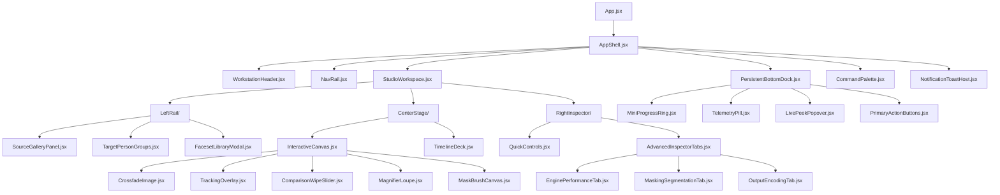

# Roop Ultimate — React UI 2.0 Design Specification
## Professional AI Media Workstation Architecture

---

## 1. Executive Summary & Design Philosophy

### Target Archetype: "Professional AI Media Workstation"
React UI 2.0 is designed as a desktop-first, pro-grade media synthesis workstation inspired by the precision, ergonomics, and density of tools like DaVinci Resolve, Adobe Lightroom, and SideFX Houdini. It moves decisively away from generic SaaS dashboards, mobile-style card grids, and visual fluff.

### Core Principles
1. **Media-First Primacy:** The central media canvas is the hero. Every inspection tool, tracking overlay, and timeline scrubber directly serves the visual frame.
2. **High Information Density without Chaos:** Clear typographic hierarchy, subtle hairline dividers (1px solid), clean tabular readouts, and intentional spacing replace oversized rounded containers and decorative cards.
3. **Zero-Hunting Ergonomics:** High-frequency creative actions (Start, Compare, Scrub, Map, Zoom, Peek) are instantly accessible via mouse gestures and single-key shortcuts.
4. **Clean Parameter Tiering:** Essential knobs (Model, Enhancer, Blend, Similarity Threshold) remain permanently visible in a sleek Quick Inspector; deep calibration tools (TRT pools, NMS, SAM2 prompts, color transfer, NVENC profiles) reside in tabbed, non-disruptive pro drawers.
5. **Deterministic State Synchronization:** Driven through the verified `adapters/` layer with sub-pixel geometry, request deadlines, and dual-phase XHR progress.

---

## 2. Layout Architecture & Viewport Adaptability

### 2.1 The Master Workstation Grid

```
+-------------------------------------------------------------------------------------------------------+
|  TOP WORKSTATION HEADER: Project Name | Target Status | Source Status | Hardware Engine | Health      |
+-------------------------------------------------------------------------------------------------------+
| NAV RAIL |  LEFT ASSET INSPECTOR  |           CENTER STAGE (PREVIEW & OVERLAYS)         | RIGHT CONTROLS  |
|          |                        |                                                     |                 |
| [Studio] | • Source Faces Gallery | [Image / Video Canvas with Sub-Pixel Zoom & Pan]   | [Quick Controls]|
| [Batch]  | • Faceset Archives     |                                                     | • Swap Model    |
| [FaceMgr]| • Target Person Groups | ┌─────────────────────────────────────────────────┐ | • Enhancer      |
| [Extras] | • Angle Coverage Bank  | │ SVG Face Boxes | 5-Pt Landmarks | Pose Vectors │ | • Blend Ratio   |
| [Gallery]|                        | └─────────────────────────────────────────────────┘ | • Face Distance |
| [History]|                        |                                                     |                 |
| [Bench]  |                        | [Filmstrip Scrubber / Timecode / In-Out Range Deck] | [Advanced Tabs] |
| [Settings|                        |                                                     | • Models/TRT    |
|          |                        |                                                     | • Masking/SAM2  |
|          |                        |                                                     | • Output/Codec  |
+-------------------------------------------------------------------------------------------------------+
|  PERSISTENT BOTTOM DOCK: Task State | SVG Progress | Frame Counters | FPS | ETA | GPU | Action Buttons |
+-------------------------------------------------------------------------------------------------------+
```

### 2.2 Responsive Breakpoint System

The workstation uses CSS Grid with fractional units and container queries rather than rigid pixel dimensions:

| Breakpoint Range | Target Display | Layout Configuration | Left Rail | Center Stage | Right Inspector | Bottom Dock |
| :--- | :--- | :--- | :--- | :--- | :--- | :--- |
| **Ultra-Wide (≥ 2560px)** | 1440p / 4K Ultrawide | 4-Column Expanded | 360px fixed | `minmax(900px, 1fr)` | 380px fixed | Persistent 56px |
| **Standard Desktop (1600px–2559px)** | 1080p / 1440p Standard | 3-Column Balanced | 300px fixed | `minmax(640px, 1fr)` | 340px fixed | Persistent 56px |
| **Compact Desktop (1366px–1599px)** | 14"–16" Laptops | 3-Column Condensed | 260px fixed | `minmax(500px, 1fr)` | 300px fixed | Persistent 52px |
| **Minimum Supported (1280px–1365px)**| 720p / Small Displays | Collapsible Drawers | Collapsible overlay | `1fr` full width | Collapsible overlay | Persistent 48px |

---

## 3. Component Hierarchy & Module Breakdown



---

## 4. Design Token System

```css
:root {
  /* Surface Hierarchy (Dark Workstation Default) */
  --bg-app: #090a0f;
  --bg-surface-1: #0f1118;
  --bg-surface-2: #151822;
  --bg-surface-3: #1c202d;
  --bg-surface-active: #24293a;
  
  /* Borders & Hairlines */
  --border-subtle: rgba(255, 255, 255, 0.06);
  --border-medium: rgba(255, 255, 255, 0.12);
  --border-strong: rgba(255, 255, 255, 0.20);
  --border-focus: #38bdf8;
  
  /* Core Brand & Accents */
  --accent-primary: #38bdf8;        /* Electric Blue */
  --accent-glow: rgba(56, 189, 248, 0.25);
  --accent-secondary: #818cf8;      /* Indigo */
  
  /* Semantic Status Tones */
  --status-success: #34d399;       /* Emerald */
  --status-warning: #fbbf24;       /* Amber */
  --status-danger: #f87171;        /* Coral Red */
  --status-info: #38bdf8;          /* Sky Blue */
  --status-processing: #a855f7;    /* Violet */
  
  /* Typography Scale (Plus Jakarta Sans + JetBrains Mono) */
  --font-sans: 'Plus Jakarta Sans', -apple-system, BlinkMacSystemFont, 'Segoe UI', sans-serif;
  --font-mono: 'JetBrains Mono', 'Fira Code', monospace;
  
  --text-micro: 9px;
  --text-nano: 11px;
  --text-mini: 12px;
  --text-body: 13px;
  --text-title: 15px;
  --text-header: 18px;
  --text-display: 22px;
  
  --text-primary: #f1f5f9;
  --text-secondary: #94a3b8;
  --text-muted: #64748b;
  --text-disabled: #475569;
}
```

---

## 5. Media Preview & Face Tracking Engine

### 5.1 Interactive Canvas Subsystem
* **Dual-Layer Crossfading:** Eliminates frame tearing and flashes on scrub.
* **Transform Matrix & Coordinate Anchoring:** Sub-pixel pan/zoom with bounds checking:
  $$\text{Pan}_{\text{clamped}} = \text{clamp}\left(\text{Pan}, -\frac{\text{ImgW} \cdot z - \text{ContainerW}}{2}, \frac{\text{ImgW} \cdot z - \text{ContainerW}}{2}\right)$$
* **Loupe Magnifier (Hotkey `G`):** 3.5× magnification loupe centered at cursor layout position.
* **Comparison Suite:** Wipe Slider (`X` to toggle vertical/horizontal), 50% Blend (`O`), Difference Mode, and Sinusoidal Auto-Swipe (`A`).
* **Mask Brush:** Dual-canvas system (translucent pink UI layer vs. solid white on transparent 0/255 export layer).

### 5.2 Face Tracking & Landmarking Overlay
* **Bounding Boxes:** Sharp 1.5px borders with corner reticles, glowing status chips:
  - Cyan (`#38bdf8`): Target face selected / assigned.
  - Amber (`#fbbf24`): Target face detected / unassigned.
  - Purple (`#a855f7`): Active multi-target match.
* **5-Point ArcFace Landmarks (Hotkey `D`):**
  - Left & Right Eye landmarks + Inter-ocular rotation line (`#38bdf8`).
  - Nose tip keypoint (`#fbbf24`).
  - Mouth left & right corners + Lip plane line (`#f472b6`).
  - Eye-midpoint to Mouth-midpoint crop orientation axis (`#a3e635`).
* **3D Head Pose Vector:** Direct degree readout displayed on nose tip (`y-14° p4° r2°`).

---

## 6. Source & Target Face Panels

### Left Rail Composition
1. **Source Identity Rail:**
   - Thumbnail strip with face index, source name, and embedding quality indicator.
   - Quick-Pin Bar: Pin favorite identity embeddings for instant recall across sessions.
   - Faceset Archive Manager button: Modal trigger for `.fsz` library.
2. **Target Face & Person Groups Panel:**
   - Grouped cards for each unique individual discovered in target media.
   - Visual mapping dropdown linking Target Person $N \to$ Source Identity $M$.
   - Angle Banking Indicators: Visual gauge showing pitch/yaw coverage banking for each target person.
   - Action buttons: `Auto-Capture`, `Auto-Angles`, `Autocluster`, `Add Angle`.

---

## 7. Contextual Controls & Parameter Tiering

### Right Rail Composition
1. **Quick Controls (Always Visible):**
   - **Swap Engine:** InSwapper, RealSwap, HyperSwap, SimSwap.
   - **Enhancer:** None, GPEN 256 Pro, GPEN Realistic, UltraMax, CodeFormer, GFPGAN, RestoreFormer++.
   - **Enhancer Blend Slider:** 0.00 to 1.00 (with numeric input).
   - **Similarity Threshold:** 0.00 to 1.00 (distance tolerance).
   - **Face Selection Mode:** Selected face, All faces, First found, Gender filter.
2. **Advanced Inspector (Tabbed):**
   - **Engine & Hardware Tab:** Execution provider (TensorRT, CUDA, CPU), TRT Precision (FP16, Mixed, FP32), Execution Threads, TRT Pool sizes (`swapper`, `detector`, `detmask`), Memory Arena limit.
   - **Masking & Boundaries Tab:** Mask engine (DFL XSeg, Face Occluder, BiSeNet, SAM2), SAM2 text prompt (`clip_text`), Face mask blend %, Merger sharpen %, Color transfer mode.
   - **Output & Encoding Tab:** Video format (MP4, MKV, WebP), Codec (NVENC HEVC, ProRes, H.264), Video Quality CRF, Post-swap AI Upscale model (Real-ESRGAN, UltraSharp, Nomos8k, etc.).

---

## 8. Persistent Processing Dock & Task Lifecycle

### Bottom Bar Layout
```
[Status Ring: 78%] [Desc: Swapping Frame 1420/1800] [FPS: 14.2] [ETA: 00:26] [GPU: RTX 4070 (68%)] | [Peek Frame] [Pause] [Stop Swap] [Start Swap]
```

* **Live Progress Ring:** SVG circular progress ring displaying real-time completion percentage.
* **Accurate Extrapolated ETA:** Derived directly from backend `eta_s` stream.
* **Live Frame Peek Popover:** Low-latency popover streaming `/api/live_frame?seq=...` without interfering with main stage.
* **Lifecycle Buttons:**
  - `Start Swap` (Primary Accent Button)
  - `Pause` / `Resume` (Warning State)
  - `Stop Swap` (Graceful abort writing MP4 `moov` atom)
  - `Add to Queue` (Secondary Button)
* **Job Completion Tray:** Appears smoothly upon finish with `Open File`, `Reveal in Explorer`, `Compare Output`, and `Quality Report` buttons.

---

## 9. Interaction Model & Keyboard Shortcut Matrix

| Key | Scope | Action |
| :--- | :--- | :--- |
| `Space` | Global / Preview | Toggle Video Playback / Pause |
| `Left` / `Right` | Timeline | Step 1 Frame Backward / Forward |
| `Shift + Left/Right` | Timeline | Step 10 Frames Backward / Forward |
| `I` / `O` | Timeline | Set In / Out Range Trimming points |
| `M` | Timeline | Add Chapter Marker at Playhead |
| `+` / `-` | Canvas | Zoom In / Out |
| `Double Click` | Canvas | Zoom to 2.5× at Cursor / Reset to 1× Fit |
| `G` | Canvas | Toggle 3.5× Magnifying Loupe |
| `B` | Canvas | Toggle Interactive Face Mask Brush Tool |
| `D` | Canvas | Toggle 5-Point Landmark & 3D Pose Debug Overlay |
| `X` | Comparison | Toggle Comparison Wipe Axis (Horizontal / Vertical) |
| `O` | Comparison | Toggle 50% Alpha Blend Mode |
| `A` | Comparison | Toggle Sinusoidal Auto-Swipe Sweep |
| `Ctrl + K` | Global | Open Command Palette & Setting Search |
| `Ctrl + S` | Global | Start Processing Current Job |

---

## 10. Execution Plan & Implementation Steps

1. **Tokens & Base Styles:** Deploy workstation CSS variables, typographic hierarchy, custom range inputs, and scrollbar styles into `react-ui-v2/src/styles.css`.
2. **AppShell & Navigation:** Construct modern workstation shell with NavRail, WorkstationHeader, PersistentBottomDock, and CommandPalette in `react-ui-v2/src/components/`.
3. **Interactive Canvas & Overlay Engine:** Rebuild `InteractiveCanvas`, `CrossfadeImage`, `TrackingOverlay`, `ComparisonWipeSlider`, and `Loupe` in `react-ui-v2/src/components/stage/`.
4. **Timeline Scrubber Deck:** Rebuild `TimelineDeck` with measured timecode ruler, In/Out range markers, and filmstrip caching in `react-ui-v2/src/components/timeline/`.
5. **Panels & Inspectors:** Implement `LeftAssetRail` (source gallery + target persons + faceset library) and `RightInspector` (quick controls + advanced tabbed drawers).
6. **Dedicated Feature Screens:** Rebuild `BatchScreen`, `FaceManagerScreen`, `ExtrasScreen`, `GalleryScreen`, `HistoryScreen`, `BenchmarkScreen`, `SettingsScreen`.
7. **Testing & Verification:** Run `test_ui2_integration.py` and `npm run lint; npm run build` to verify 100% contract compliance and flawless compilation.
