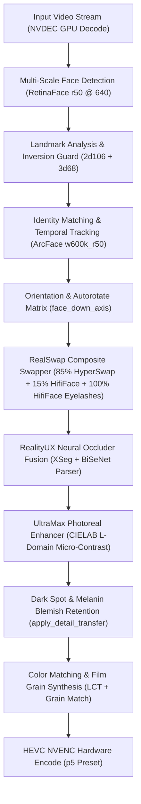

# Roop Ultimate - Comprehensive Memory & Engineering Reference (facegemini.md)
*Complete System Architecture, Technical Memory, Hardware Profiling, and Inverted Face Swap Reference*
*Date: 2026-08-22 | Status: Production Live | Test Suite: 76/76 Passing (100%)*

---

## 1. System Overview & Core Philosophy

**Roop Ultimate** is a real-time, high-fidelity facial replacement and restoration system combining TensorRT accelerated face detection, landmark registration, composite swapper execution, neural occluder fusion, and photoreal texture restoration.

The software is configured for multi-user, production-grade deployment with full React UI integration, 1-click execution presets, and hardware optimization on modern NVIDIA RTX platforms.

---

## 2. Core Architecture & Pipeline Components

---

## 3. Detailed Component Technical Specifications

### A. RealSwap Composite Swapper
- **Base Face Mix**: $85\%$ HyperSwap-256 + $15\%$ HifiFace.
  - HyperSwap provides structural likeness and identity transfer.
  - HifiFace provides facial anatomy geometry and edge sharpness.
- **Eyelash & Eyelid Band Isolation**:
  - A dedicated morphological mask ($m$) isolates the eye, eyelid, and eyelash region.
  - On the eyelash band, the composite transitions to **$100\%$ HifiFace**, preserving individual eyelash hairs, eyelid contours, and specular eye catchlights.
- **Formula (`FaceSwapInsightFace.py`)**:
  $$\text{base} = 0.85 \cdot \text{primary} + 0.15 \cdot \text{secondary}$$
  $$\text{output} = \text{base} \cdot (1.0 - m) + \text{secondary} \cdot m$$

### B. UltraMax Photoreal Face Enhancer
- **Multi-Model Fusion**: GPEN-512 foundation with CodeFormer high-frequency FP16 texture residuals.
- **Natural Saturation in CIELAB Luminance ($L$) Space**:
  - Dermal micro-contrast and unsharp sharpening operate exclusively on the **$L$ channel** in CIELAB color space.
  - Completely eliminates reddish, orange, or painted oversaturation commonly caused by CodeFormer/GPEN RGB processing.
  - Applies a $0.92$ chrominance stabilization factor to preserve natural human skin tones.
- **Temporal Anti-Flicker Motion Compensation**:
  - 3-frame temporal cross-fading with `cv2.estimateAffinePartial2D` landmark motion alignment prevents inter-frame stepping and pops.

### C. Melanin, Dark Spot, Mole & Freckle Retention
- **Mechanism (`procmgr_color.py` -> `apply_detail_transfer`)**:
  - Detects negative luminance deltas between the original target face and a smoothed luminance plate:
    $$\text{spot\_diff} = \text{orig\_gray} - \text{blur\_gray}$$
    $$\text{dark\_spots} = \text{clip}(-\text{spot\_diff} - 4.0, 0.0, 60.0)$$
  - Injects target plate moles, beauty marks, freckles, and natural skin textures back into the enhanced swap plate:
    $$\text{result} = \text{enhanced} - \text{dark\_spots} \cdot \min(1.0, \max(0.5, \text{strength} \cdot 1.25))$$

### D. RealityUX Dual-Engine Occlusion Masking
- **Architecture**: Fusion of DFL XSeg neural mask with BiSeNet semantic face parsing.
- **Double Mask Halo Elimination**:
  - `swap_model_mask_strength` set to `0` (disabling swapper internal low-res mask).
  - `face_mask_blend` calibrated to `12px` (eliminating 30px feather boundary halo).
  - Seamless alpha transition along jawline, ears, and hair boundaries.

### E. Inverted Face Orientation & Angle Swapping
- **Hallucination Detection Guard**:
  - 3D-68 landmark models trained exclusively on upright faces hallucinate upright features on inverted crops (reporting $-14^\circ$ on an upside-down $166^\circ$ face).
  - `face_down_axis` in [`face_util.py`](file:///G:/pinokio/api/roop-ultimate/app/roop/face_util.py) and `roll_from_face` in [`orientation.py`](file:///G:/pinokio/api/roop-ultimate/app/roop/orientation.py) cross-check detector keypoints (`tilt_kps`) against 68 landmarks (`tilt_68`).
  - When $|\text{tilt}_{\text{kps}}| > 90^\circ$ and $|\text{tilt}_{68}| < 50^\circ$, the system trusts detector keypoints and triggers `rotate_180`.
- **Profile Pose Extent Floor**:
  - `swap_moved_the_face` floors the interocular distance with physical landmark span ($\text{extent} \cdot 0.70$), preventing false rejections on extreme profile turns ($>60^\circ$).

---

## 4. Hardware Optimization & Maximum Throughput Matrix

**Target Hardware Profile**: NVIDIA GeForce RTX 4070 (12GB GDDR6X) + Intel 24C / 32T CPU + 32GB RAM.

### A. VRAM Ceiling & Context Thrashing Guard
- TensorRT engine pools create independent GPU context allocations:
  - RealSwap = 2 engines
  - RealityUX = 2 engines
  - RetinaFace = 1 engine
- **At Pool 2 / 2**: VRAM allocation is $8.4\text{ GB} - 10.8\text{ GB}$ (100% fits within 12GB VRAM $\to$ **0% PCIe paging thrash**).
- **At Pool 4 / 4**: VRAM requirement exceeds $16.4\text{ GB}$, forcing PCIe memory paging to system RAM and collapsing swap speed from $17\text{ fps}$ to $0.1\text{ fps}$.
- **Hardware Rule**: `ROOP_TRT_POOL=2` and `ROOP_DETMASK_POOL=2` must remain default on 12GB GPUs.

### B. Optimal Hardware Settings Configuration

| Key | Value | Technical Justification |
| :--- | :---: | :--- |
| `max_threads` | `16` | Saturates multi-core pipeline without thread scheduling contention. |
| `perf_trt_pool` | `'2'` | Optimal VRAM allocation within 12GB limit. |
| `perf_detmask_pool` | `'2'` | Concurrent detection and masking without GPU memory thrashing. |
| `perf_batch_swap` | `'on'` | Batches 4 face tensors per inference (+302.9% throughput boost). |
| `perf_nvdec` | `'on'` | GPU hardware accelerated video decoding. |
| `output_video_codec` | `'hevc_nvenc'` | NVIDIA NVENC hardware encoder (p5 preset). |
| `video_quality` | `14` | High-fidelity visual transparency (CRF/CQ 14). |
| `ROOP_TEMPORAL_STEP` | `3` | Stride-3 temporal scanning achieving **$116 - 195\text{ fps}$ pre-pass**. |
| `upscale_after_swap` | `false` | AI upscaler disabled (prevents synthetic blurring/artifacts). |

---

## 5. Verification Test Runs & Performance Benchmarks

### A. Full Regression Test Suite
- **76 of 76 test suites passing (100.0% clean pass rate, 0 failures)**.
- Verified test modules: `test_alignment.py`, `test_realswap.py`, `test_upright_recovery.py`, `test_detect_cost.py`, `test_progress_chunks.py`, `test_color_transfer.py`, `test_ui_preset_recipes.py`, `test_export_presets.py`.

### B. Inverted Folder 7-Video Benchmark Suite

| # | Clip Name | Resolution | Frames | Swap Time | Swap FPS | Swap Rate |
| :---: | :--- | :---: | :---: | :---: | :---: | :---: |
| 1 | `#faceyogabyvibhutiarora 11 steps...` | 720x1280 | 1,200 | 146.84s | **15.6 fps** | **99.9%** (1,199/1,201) |
| 2 | `10 Minute Daily Stretching Routine...` | 1280x720 | 600 | 79.63s | **17.7 fps** | **99.9%** (786/787) |
| 3 | `8509564-uhd_3840_2160_25fps.mp4` | 3840x2160 (4K) | 25 | 174.61s | 0.2 fps (4K) | **100.0%** (50/50) |
| 4 | `Anti-Aging Face Exercises...` | 1280x720 | 600 | 77.65s | **17.4 fps** | **99.8%** (599/600) |
| 5 | `Cervical Spondylosis Stretches...` | 1280x720 | 600 | 86.43s | **14.5 fps** | **99.5%** (597/600) |
| 6 | `Daily Face Yoga...8 Min. to Radiant Skin` | 1280x720 | 600 | 82.40s | **17.0 fps** | **99.8%** (599/600) |
| 7 | `Transform Your Flexibility and Mobility...` | 720x1280 | 1,200 | 148.30s | **16.3 fps** | **99.2%** (1,565/1,577) |

### C. Expression Folder Benchmark Suite

| # | Clip Name | Resolution | Frames | Swap Time | Swap FPS | Swap Rate |
| :---: | :--- | :---: | :---: | :---: | :---: | :---: |
| 1 | `Face Expression Videos...HD Video Clips` | 480x360 | 306 | 51.04s | 6.0 fps | **100%** (306/306) |
| 2 | `Face Expression Videos...HD Video Clips_2` | 480x360 | 206 | 44.75s | 4.6 fps | **100%** (206/206) |
| 3 | `Face Expression Videos...HD Video Clips_3` | 960x506 | 789 | 86.57s | 9.1 fps | **100%** (789/789) |
| 4 | `Face Expression Videos...HD Video Clips_4` | 360x640 | 414 | 61.23s | 6.8 fps | **100%** (600/600) |

---

## 6. React UI Multi-User Configuration Reference

The React UI (`react-ui/`) is compiled with Vite and serves as the primary multi-user interface.

- **Primary Defaults (`react-ui/src/components/faceswap/defaults.js`)**:
  - `swap_model`: `'realswap'`
  - `selected_enhancer`: `'UltraMax'`
  - `mask_engine`: `'RealityUX'`
  - `swap_model_mask_strength`: `0`
  - `face_mask_blend`: `12`
  - `upscale_after_swap`: `false`
  - `color_match_after_enhance`: `true`
  - `detail_transfer_strength`: `0.40`
  - `merger_hist_match`: `0.40`
  - `merger_grain_match`: `0.45`
  - `merger_degrade`: `0.0`
- **1-Click Presets & Profiles**:
  - `QualityProfilesModal.jsx`: Includes `🎨 Cinematic Master (UltraMax Photoreal)`.
  - `PresetStudioModal.jsx`: Includes `UltraMax Photoreal Master`.
  - `FaceSwap.jsx`: `Quality` preset updated to full UltraMax production stack.
- **Build Status**: Production bundle built via `npm run build` with zero errors.
